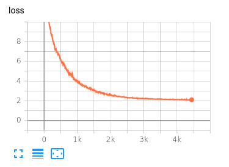

# Changelog 

A cada treinamento geral da rede é adicionado uma versão com os resultados parciais avaliando o treinamento gerado.

## [0.0.1] - 2020-06-08

### Descrição

Primeiro teste geral realizado utilizando todas as técnicas desenvolvidas para incorporar novas palavras ao vocabulário inicial.

### Dados gerais
1. **Treinamentos** - 16 treinamentos entre os dias <ins>04 e 08 de Junho</ins>.
2. **Arquitetura** - [Pay Less Attention with Lightweight and Dynamic Convolutions](https://github.com/pytorch/fairseq/blob/master/examples/pay_less_attention_paper/README.md)
3. **Parâmetros** - [1](https://github.com/alvesmarcos/hierarchical_transfer_learning_nmt/blob/master/params/train.json) & [2](https://github.com/alvesmarcos/hierarchical_transfer_learning_nmt/blob/cae2cb0ae8c2039832511bce839c936ef0fc9f9a/params/train.json)
4. **Estratégias** - [Padrão](#padrao), [Randômica](randomica), Similaridade e GloVe
5. **Divisão de Dados** - 50%, 75% e 100%

### Treinamentos

Para rodar cada treinamento foi utilizado a ferramenta [Colab](https://colab.research.google.com/notebooks/intro.ipynb#recent=true) desenvolvida pela Google.

#### Padrão

*[Parâmetros 1](https://github.com/alvesmarcos/hierarchical_transfer_learning_nmt/blob/master/params/train.json)*

* 50% - ~Informar dados dos dicionários e sentenças~

  
  

**BLEU**: ~Informar Bleu~

* 75% - ~Informar dados dos dicionários e sentenças~

  
  

**BLEU**: ~Informar Bleu~

* 100% - ~Informar dados dos dicionários e sentenças~

  
  

**BLEU**: ~Informar Bleu~

*[Parâmetros 2](https://github.com/alvesmarcos/hierarchical_transfer_learning_nmt/blob/cae2cb0ae8c2039832511bce839c936ef0fc9f9a/params/train.json)*

* 50% - ~Informar dados dos dicionários e sentenças~

  
  

**BLEU**: ~Informar Bleu~

* 75% - ~Informar dados dos dicionários e sentenças~

  
  

**BLEU**: ~Informar Bleu~

* 100% - ~Informar dados dos dicionários e sentenças~

  
  

**BLEU**: ~Informar Bleu~

#### Randômica

*[Parâmetros 1](https://github.com/alvesmarcos/hierarchical_transfer_learning_nmt/blob/master/params/train.json)*

* 75% - ~Informar dados dos dicionários e sentenças~

  
  

**BLEU**: ~Informar Bleu~

* 100% - ~Informar dados dos dicionários e sentenças~

  
  

**BLEU**: ~Informar Bleu~

*[Parâmetros 2](https://github.com/alvesmarcos/hierarchical_transfer_learning_nmt/blob/cae2cb0ae8c2039832511bce839c936ef0fc9f9a/params/train.json)*

* 75% - ~Informar dados dos dicionários e sentenças~

  
  

**BLEU**: ~Informar Bleu~

* 100% - ~Informar dados dos dicionários e sentenças~

  
  

**BLEU**: ~Informar Bleu~

#### Similaridade

*[Parâmetros 1](https://github.com/alvesmarcos/hierarchical_transfer_learning_nmt/blob/master/params/train.json)*

* 75% - ~Informar dados dos dicionários e sentenças~

  
  

**BLEU**: ~Informar Bleu~

* 100% - ~Informar dados dos dicionários e sentenças~

  
  

**BLEU**: ~Informar Bleu~

*[Parâmetros 2](https://github.com/alvesmarcos/hierarchical_transfer_learning_nmt/blob/cae2cb0ae8c2039832511bce839c936ef0fc9f9a/params/train.json)*

* 75% - ~Informar dados dos dicionários e sentenças~

  
  

**BLEU**: ~Informar Bleu~

* 100% - ~Informar dados dos dicionários e sentenças~

  
  

**BLEU**: ~Informar Bleu~

#### GloVe

*[Parâmetros 2](https://github.com/alvesmarcos/hierarchical_transfer_learning_nmt/blob/cae2cb0ae8c2039832511bce839c936ef0fc9f9a/params/train.json)*

* 75% - ~Informar dados dos dicionários e sentenças~

  
  

**BLEU**: ~Informar Bleu~

* 100% - ~Informar dados dos dicionários e sentenças~

  
  

**BLEU**: ~Informar Bleu~

[Unreleased]: https://github.com/zokla-io/MaisOpcao/tree/dev
[0.0.1]: https://github.com/zokla-io/MaisOpcao/tree/dev
